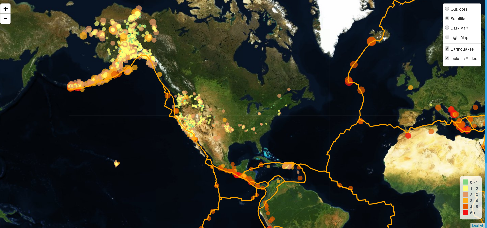

# Mapping-Web-Leaflet-Challenge
Challenge is to visualize the earthquake data and create a map using Leaflet that plots all of the earthquakes from the dataset based on their longitude and latitude.

# <ins> Outdoor View </ins>

# <ins> Satellite View </ins>

# <ins> Dark View </ins>

# <ins> Light View </ins>

