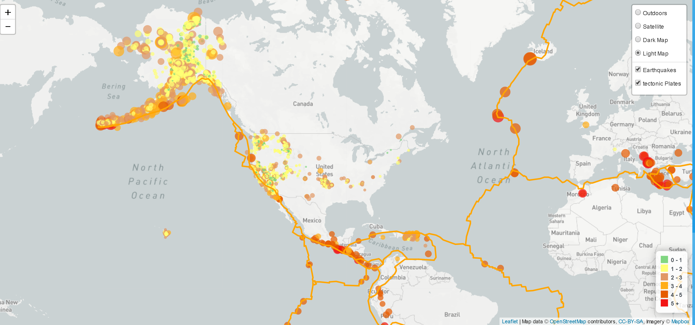

# Mapping-Web-Leaflet-Challenge
Challenge is to visualize the earthquake data and create a map using Leaflet that plots all of the earthquakes from the dataset based on their longitude and latitude.

## Final Link of the Project 

https://saranyapandiaraj.github.io/Mapping-Web-Leaflet-Challenge/

<b> Note : (The Map will take few seconds time to load) </b>

 

	 
The below data represents earthquakes visulaization for the past 30 days which is updated every day using the 
      <a href="http://earthquake.usgs.gov/earthquakes/feed/v1.0/geojson.php" target="_blank">United States Geological Survey (USGS GeoJSON Feed).</a>  
      Leaflet JS Library is used to plot the below visulaization.
	  Earthquakes with higher magnitudes appears larger and darker in color.
   

   
## <ins> Outdoor View </ins>

## <ins> Satellite View </ins>

## <ins> Dark View </ins>

## <ins> Light View </ins>

## <ins> Legend </ins>

